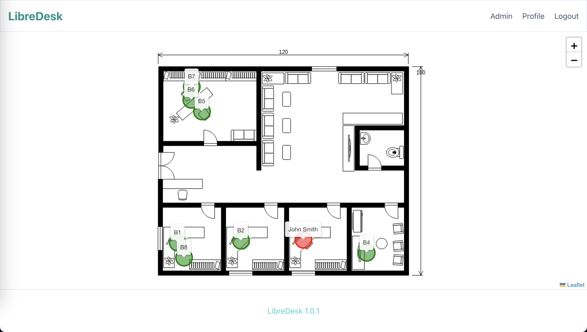

# LibreDesk

LibreDesk is a workspace management platform that allows users to efficiently book desks. When accessing its website, an interface is presented that invites users to log in to start reserving their space.

## Demo
https://libredesk.brj.es

## Requirements

PHP8.3
Composer

## Installation

`git clone git@github.com:borjajimnz/libredesk.git`

`php artisan migrate --seed`

## About

LibreDesk is written in PHP using Laravel Framework and FilamentPHP (under lovely Livewire).

https://laravel.com/
https://filamentphp.com/
https://livewire.laravel.com/
https://tailwindcss.com/
